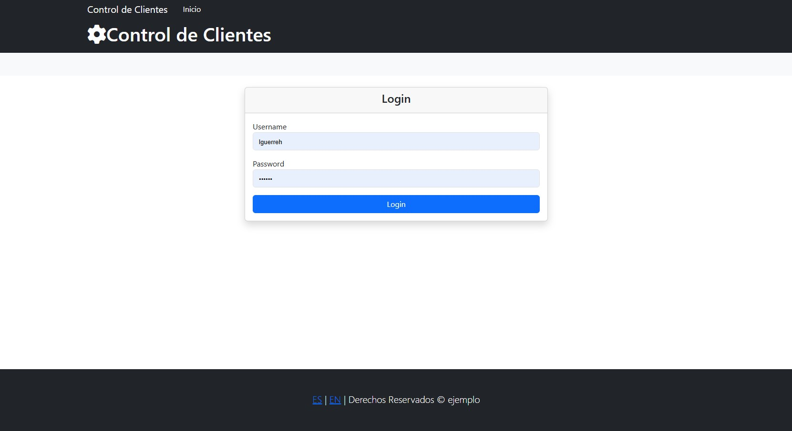
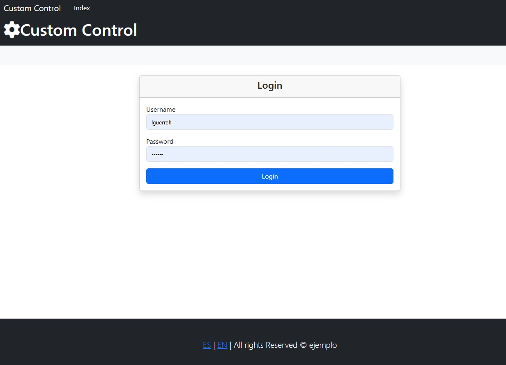
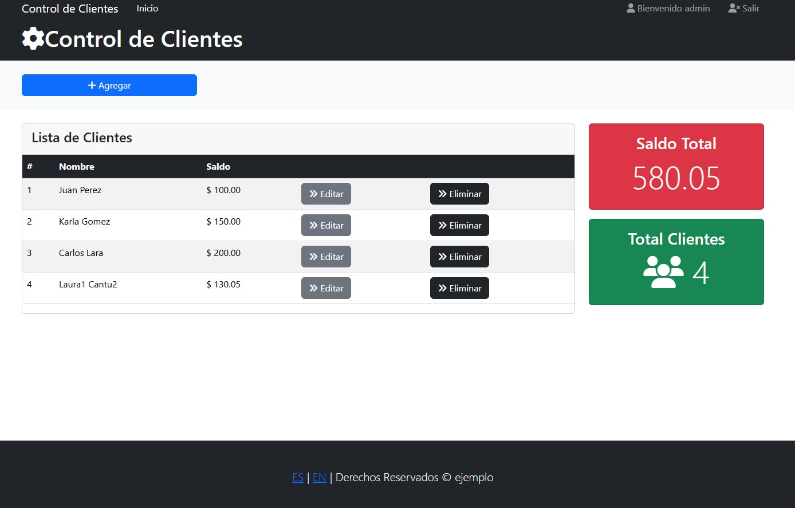
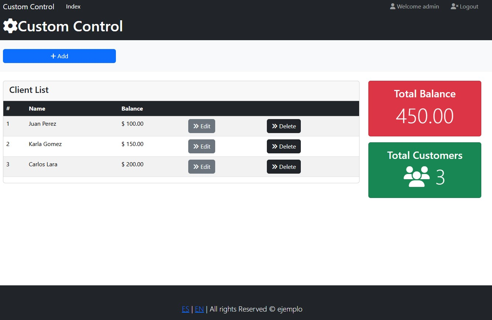
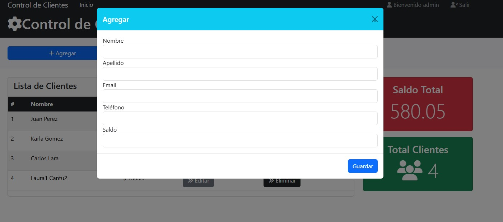
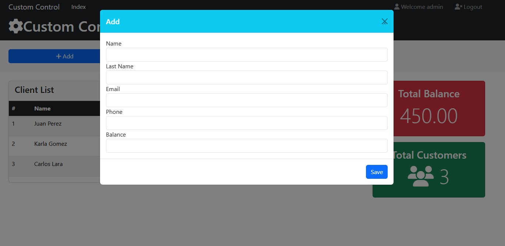
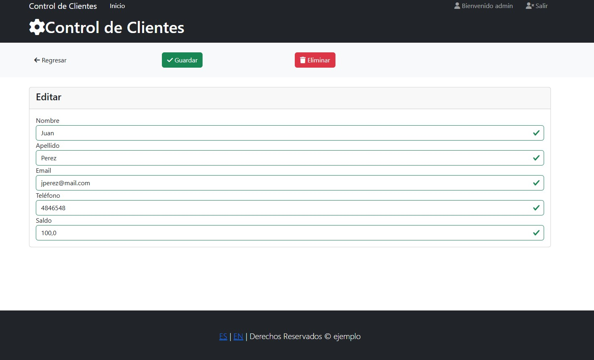
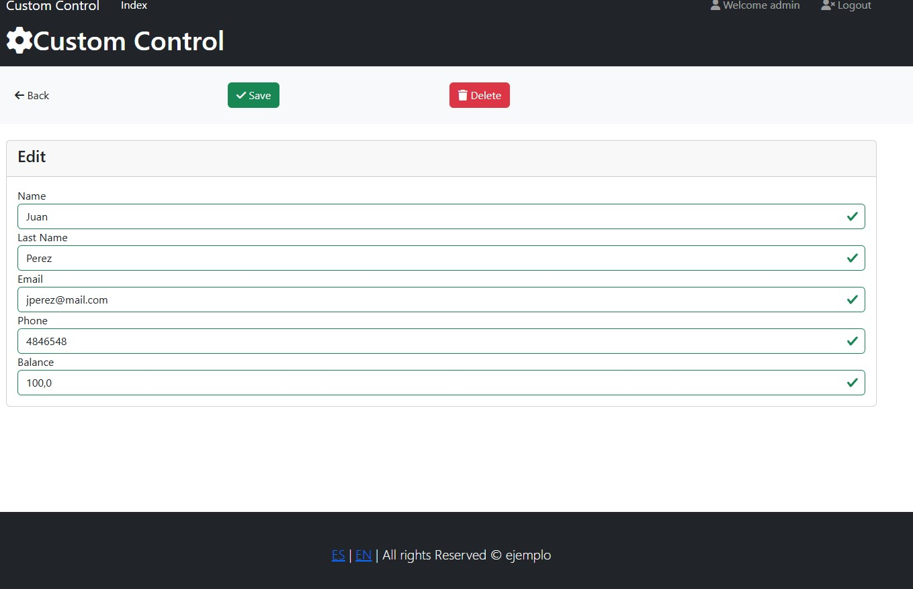
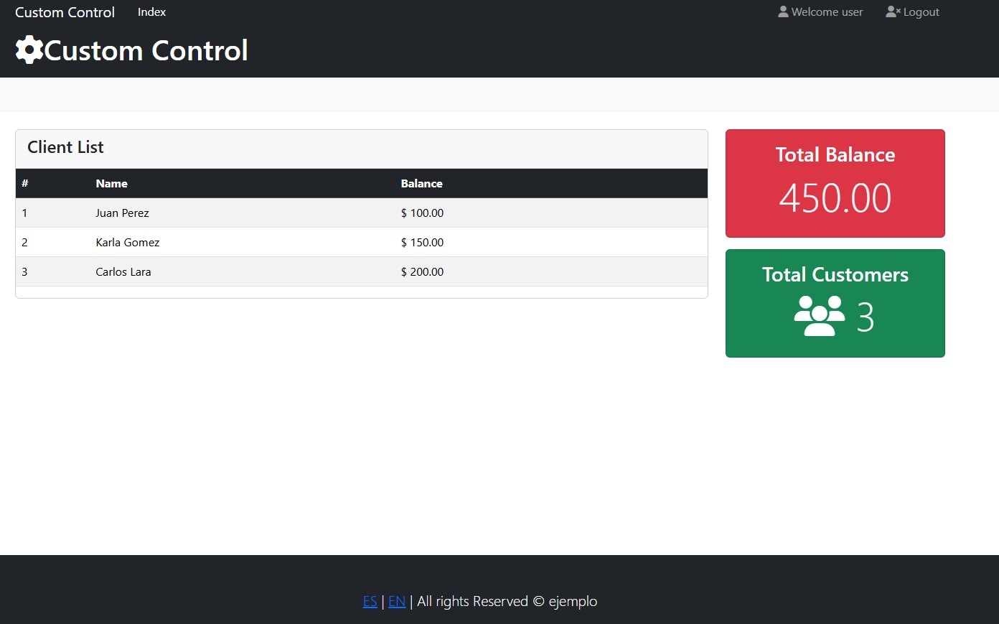
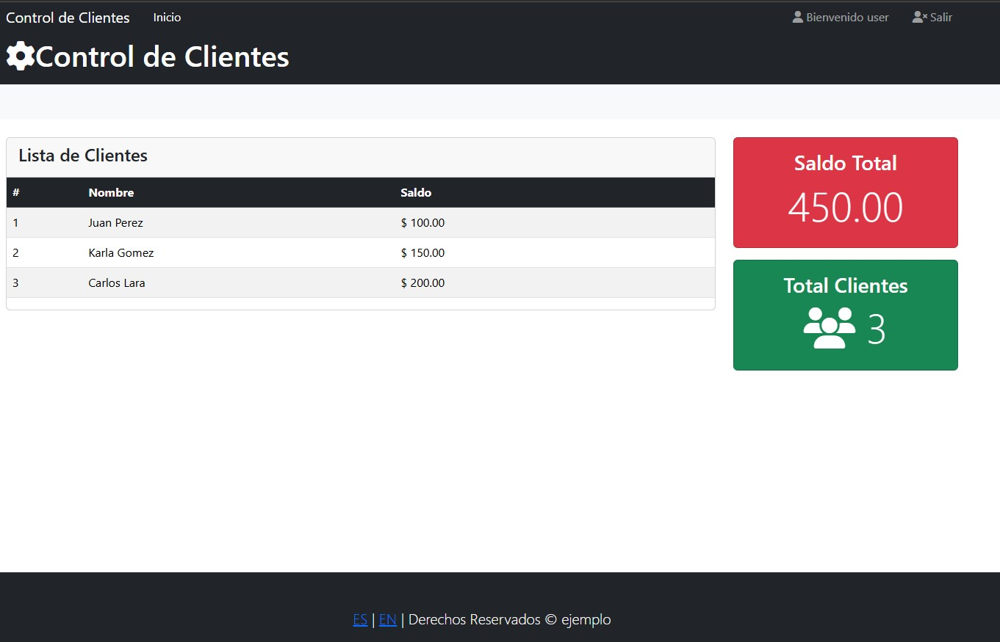

# Control de Clientes - Spring Boot

Aplicación web desarrollada con Spring Boot para la gestión de clientes, 
implementando operaciones CRUD, autenticación de usuarios y soporte de múltiples idiomas.

---------------------------------------------------------------------------

##  Tecnologías utilizadas

- Java 21
- Spring Boot 3
- Spring MVC
- Spring Data JPA / Hibernate
- Spring Security
- Thymeleaf
- MySQL
- Bootstrap 5 (WebJars)
- Font Awesome (WebJars)
- Maven

---------------------------------------------------------------------------
## Dependencias principales

El proyecto utiliza los siguientes starters de Spring Boot:

- spring-boot-starter-web
- spring-boot-starter-thymeleaf
- spring-boot-starter-security
- spring-boot-starter-data-jpa
- spring-boot-starter-validation

Extras:

- thymeleaf-extras-springsecurity6
- mysql-connector-j
- lombok
- devtools

---------------------------------------------------------------------------

## Funcionalidades

- CRUD de clientes
- Autenticación de usuarios (login)
- Control de acceso por roles (ADMIN / USER)
- Validación de formularios
- Internacionalización (i18n) - Español / Inglés
- Plantillas reutilizables con Thymeleaf

---------------------------------------------------------------------------
## Capturas de pantalla
###  Pantalla de Login

### Gestión de Clientes

### Agregar de Cliente

### Editar de Cliente

### Vista Usuario sin permisos

---------------------------------------------------------------------------

## Base de Datos

Este proyecto utiliza MySQL.

### Script

El script de base de datos se encuentra en: /database/script.sql

## Configuración

### 1. Crear base de datos

sql
CREATE DATABASE test;

### 2. Configurar conexión

Editar:

src/main/resources/application.properties

Ejemplo:

properties
spring.datasource.url=jdbc:mysql://localhost:3306/test
spring.datasource.username=root
spring.datasource.password=tu_password
spring.jpa.hibernate.ddl-auto=none

---------------------------------------------------------------------------
### Usuarios de prueba
Usuario	Password
admin	123
user	123
---------------------------------------------------------------------------
Internacionalización

La aplicación permite cambiar dinámicamente el idioma:

Español ES
Inglés EN

Implementado mediante archivos messages.properties y configuración de locales en Spring.

---------------------------------------------------------------------------
/src
/database
pom.xml
README.md

---------------------------------------------------------------------------

##  Autor
Leonardo Guerrero

---------------------------------------------------------------------------

##  Notas
Proyecto desarrollado con fines educativos, aplicando buenas prácticas en desarrollo backend con Spring Boot.

### Buenas prácticas implementadas

- Uso de arquitectura MVC
- Separación de capas (Controller, Service, Repository)
- Uso de DTO/Entidad
- Manejo de validaciones
- Seguridad basada en roles
